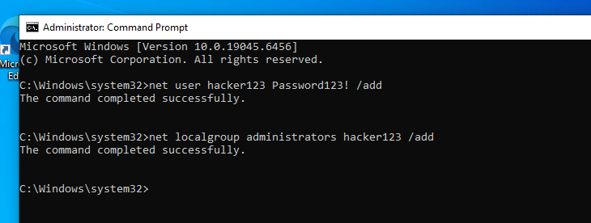
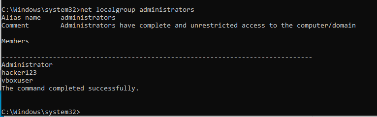
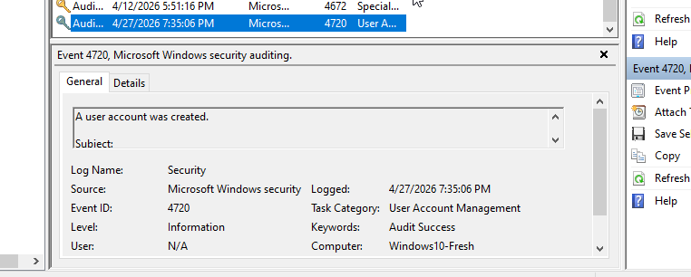

# 🧠 Privilege Escalation Detection (Windows Event Log Analysis)

## 🎯 Objective
The goal of this lab is to simulate privilege escalation on a Windows system and detect it using Event Viewer and system commands. This demonstrates how attackers gain elevated access and how defenders can identify suspicious behaviour.

---

## 🧩 What is Privilege Escalation?

Privilege escalation occurs when a user gains higher-level permissions than intended, typically moving from a standard user to an administrator.

---

## 💥 Why Attackers Use It

Attackers escalate privileges to:
- Gain full control of a system  
- Access sensitive data  
- Install malware  
- Maintain persistence  

---

## 🧪 Lab Setup

This lab was performed on a Windows virtual machine using Command Prompt and Event Viewer.

---

## 🧪 Step 1 — Create a User

```cmd
net user hacker123 "Password123!" /add
```

**Explanation:**  
Creates a new local user account named `hacker123`.

---

## 🧪 Step 2 — Add User to Administrators Group

```cmd
net localgroup administrators hacker123 /add
```

**Explanation:**  
Adds the user to the Administrators group, simulating privilege escalation.

---

## 🧠 Attacker Simulation

This mirrors real-world attacker behaviour:
1. Gain initial access  
2. Create a new account  
3. Escalate privileges to administrator  

---

## 🔍 Detection Using Event Viewer

### Open Event Viewer

```cmd
eventvwr.msc
```

Navigate to:

```
Windows Logs → Security
```

---

## 🔎 Key Event IDs

| Event ID | Description |
|----------|------------|
| 4720 | User account created |
| 4728 / 4732 | User added to a privileged group |
| 4672 | Special privileges assigned |

---

## ⚠️ Important Findings

- Event ID **4720** (user creation) was successfully detected  
- Event ID **4732** (group assignment) was inconsistent  
- Event ID **4672** did not show current timestamps  

---

## 🧠 Logging Limitation Insight

Windows logs may not always capture all activity due to:
- Misconfigured audit policies  
- VM limitations  
- Inconsistent logging behaviour  

This highlights the importance of using multiple methods to verify suspicious activity.

---

## 🔐 Verifying Privilege Escalation

To confirm admin access:

```cmd
net localgroup administrators
```

---

## ✅ Result

The user `hacker123` appeared in the Administrators group, confirming successful privilege escalation.

---

## 🚨 Indicators of Suspicious Activity

- Unexpected account creation  
- Immediate assignment of admin privileges  
- Unusual usernames (e.g. `hacker123`)  
- Multiple related events occurring within a short time  

---

## 🧠 Analysis 

A new user account was created and shortly after granted administrative privileges. This sequence of events is commonly associated with privilege escalation techniques used by attackers to maintain persistence and gain elevated access.

Even though some logs were inconsistent, privilege escalation was confirmed through group membership verification.

---

## 🛡️ Recommended Response Actions

If this activity was detected in a real environment:

- Disable the suspicious account  
- Remove the account from the Administrators group  
- Investigate the source of the activity  
- Review system logs for further malicious behaviour  
- Reset potentially compromised credentials  

---

## 💥 Key Takeaways

- Privilege escalation is a critical stage in cyber attacks  
- Event logs are useful but not always complete  
- Multiple verification methods are essential  
- Analytical thinking is key in security investigations  

---

## 🔥 Skills Demonstrated

- Windows Event Log analysis  
- Understanding of privilege escalation techniques  
- Threat detection and investigation  
- Blue Team / SOC analyst mindset  
